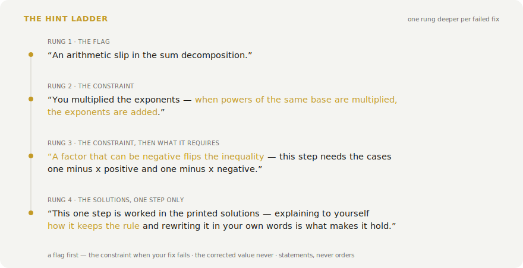
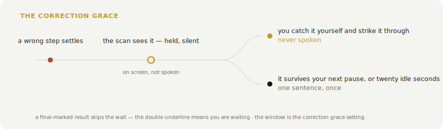

<p align="center">
  
</p>

# nuclear·math

   

A math tutor for paper. You write with a Neo Smartpen, the strokes stream into the browser over Bluetooth, and a vision model reads the page as it grows — no OCR pass, no typing, no photographing your notebook. While the work is right it stays silent. When a step settles wrong, it first gives you room to catch the slip yourself, then speaks one sentence that names the rule the step broke — in English or Swiss German. And when every result on the page carries its final mark, the verdict comes at once.

<p align="center">
  
</p>

## The hint names the rule

A bare "this is wrong" measures near zero in the feedback literature, because you could just look the answer up. What moves learning is an explanation that stops short of the answer — so every hint here is built around the constraint the step violates: the general law or requirement it breaks, stated so it holds with any numbers, never applied to yours. Hints climb a ladder, one rung per failed fix, the way a human tutor escalates. The first rung locates the step and hands you the broken rule — an arithmetic slip carries its governing law too, not a bare "recheck". The second keeps the constraint and adds the concrete move along your own route that satisfies it. The last sends you to the printed solutions for that one step, to explain it to yourself and rewrite it in your own words. A question mark written next to a flagged spot advances the ladder without waiting for a failed attempt.

<p align="center">
  <picture>
    <source media="(prefers-color-scheme: dark)" srcset="docs/ladder-dark.svg">
    
  </picture>
</p>

The answer itself never comes. In a randomized trial with about a thousand math students, an answer-revealing chatbot made exam scores worse than no help at all, while the same model behind a no-reveal guardrail helped. So the tutor names laws and moves, and the values stay yours to find — which is also why the fixes stick.

It does not pounce either. A freshly settled mistake is seen but not spoken: the sentence is held until it survives your next stretch of writing, or until the pen has sat idle for about twenty seconds — long enough that you are stuck rather than thinking. Catch the slip in that window, strike it through, and you never hear about it, which is the better outcome anyway — an error you find yourself teaches more than one read to you. Only a final-marked page skips the wait: the mark says you are done and waiting. The window is the correction grace in the engine settings; zero turns it off.

<p align="center">
  <picture>
    <source media="(prefers-color-scheme: dark)" srcset="docs/grace-dark.svg">
    
  </picture>
</p>

Your paper conventions are the interface. A line struck through or marked "falsch" with an arrow to a redo is finished business, never re-flagged — and rewriting a solution from scratch supersedes the flagged attempt, so the newest one is what gets judged. An intermediate result is left alone while you are still simplifying it. A double underline marks a result final (a box or a circle counts too), and a fully marked page always gets a verdict, never silence.

## How it works

The pen streams (x, y, pressure) points over Web Bluetooth onto a canvas. When you pause, the page is cropped to just the ink and sent to the OpenAI API as a vision message; the model reads the handwriting directly. The moment the whole question is on the page, GPT-5.4 solves it once at medium effort and keeps that answer as a checklist. From then on GPT-5.4 mini verifies every scan against the checklist, staying quiet while a line is mid-working and speaking only once a wrong step has settled and outlived the correction grace. GPT-5.4 signs off a finished, correct answer before the app says so. The strong model runs twice per problem — once to solve, once to confirm — and the cheap one carries the repetitive middle.

Grading follows school convention rather than pedantry. A simplification task assumes its expressions are defined, so the tutor will not demand absolute-value bars the textbook answer omits — but it will never wave through a lost solution of an equation. Everything is spoken as words rather than symbols — "x squared", "the square root of two" — and the German voice keeps Swiss spelling.

## What it remembers

Every mistake you fix becomes a review card, built from your own error and the worked solution already in hand, so you re-test the actual fix on a spacing schedule rather than a generic question bank. Corrected errors are the most memorable kind of correction, but they fade after about a week — the expanding schedule is what makes the fix permanent.

Every solved problem also tags the skills behind it against a fixed map of 125 math skills, from sign handling up through the chain rule and proof by induction. Each skill carries a rating that climbs on a clean solve, fades toward a guess as it goes stale, and stays provisional until enough problems have run through it. The Progress tab turns that into a recommendation — the weakest skill worth drilling, the strongest one going stale — and can generate a practice problem for it on demand, pitched so you would get it right about four times in five. Copy it onto the pad and the loop starts again. None of the tracking costs an extra request, and it can be turned off.

The same data drives a rating, chess-style. Every problem is a rated game — its difficulty is the opponent's strength — and a dozen problems in you carry a number on a familiar scale: 1600 means solid at the BM median, and each step of 400 is one stage of a ladder that runs from secondary school through the school system's end and on into degree mathematics, where the top bands are earned with proofs, not computations. The rank titles are student identities along that road. A rank arrives fast, climbs with the curve, and falls when you lose to problems you should beat. Grinding easy material cannot farm it: a win the rating already expected teaches it nothing, so climbing means beating problems at your level or above. The rating curve over time is the one answer to how fast you are getting better; the per-skill map underneath is the diagnostic that steers what to drill.

<p align="center">
  <picture>
    <source media="(prefers-color-scheme: dark)" srcset="docs/skill-dark.svg">
    
  </picture>
</p>

## Presets

The grader is one system prompt plus a few settings, edited live in the Presets tab or in `config/modes.json`. New presets clone the shipped math grader, so a variant starts from the tuned baseline — the conventions, the hint ladder, the self-correction protocol — instead of a blank slate. `feedbackStyle` is `"spoken"`, `"chime"`, or `"both"`; `debounceMs` is the pause before a check. The engine settings — models, effort, image quality, scan gating, the correction grace — live in `config/settings.json` and the same panel; the per-model prices the Usage tab computes cost from are pinned in `src/models.ts`.

## Run it

You need Node and a Chromium-based browser. Web Bluetooth is not in Safari or Firefox, and Brave has it off by default (enable it at `brave://flags/#brave-web-bluetooth-api`).

```bash
npm install
cp .env.example .env   # then add your OpenAI API key
npm run dev
```

Open the printed URL, connect the pen, and write. Pairing only works over `localhost` or `https`, and on macOS the browser needs Bluetooth permission. Connecting is always the button — the app never grabs the pen on its own. The key is read from `VITE_OPENAI_API_KEY` and used from the browser, so keep it local and use one you can rotate.

## Hardware

| Item | Price |
|---|---|
| Neo Smartpen (M1 / M1+ or compatible) | CHF 74 to 129 |
| D1 refills (3-pack) | CHF 5 |
| Ncode paper (print your own or buy a notebook) | CHF 0 to 16 |
| Any BLE earbud (optional, for spoken feedback in your ear) | CHF 15 to 20 |

## License

[MIT](LICENSE)
