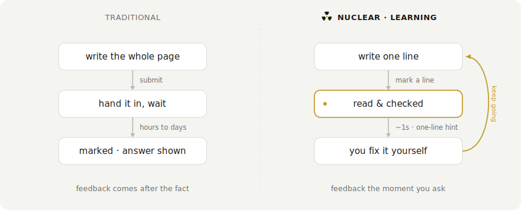
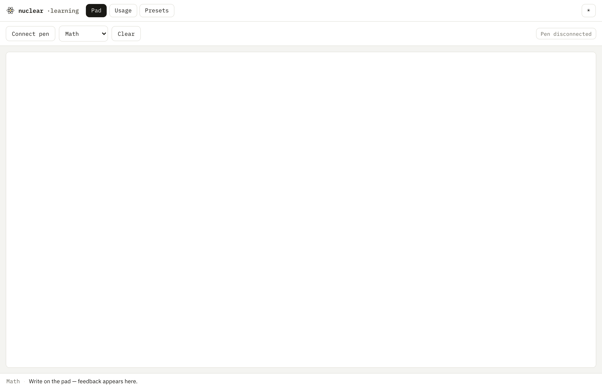
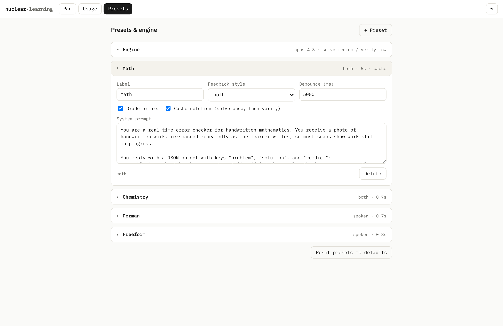
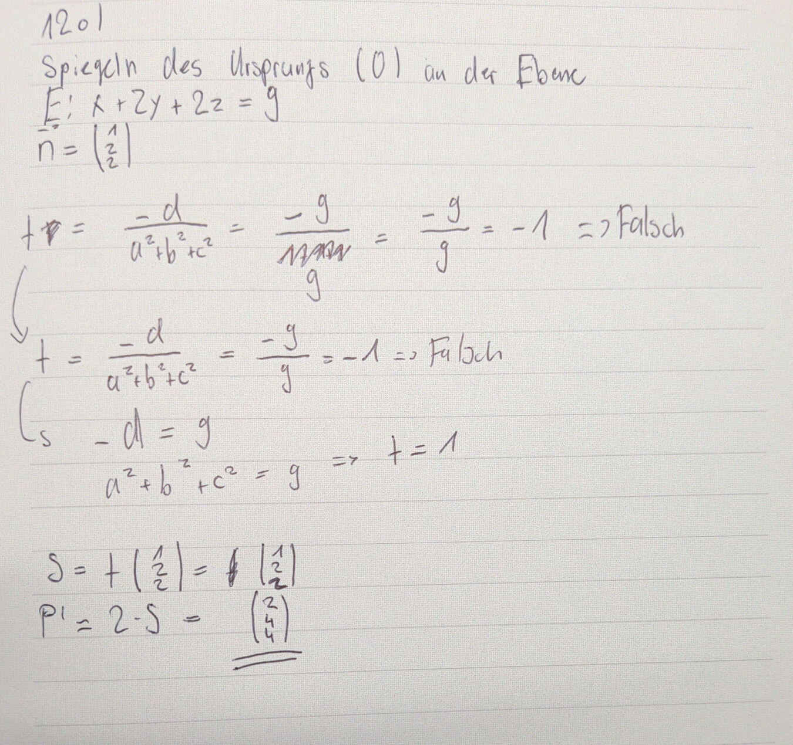
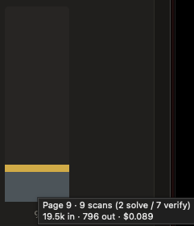

<p align="center">
  
</p>

# nuclear-learning

   

> You antisocial folks will particularly like this one

Real-time feedback for handwritten work. You write on paper with a Neo Smartpen. The strokes stream into the browser over Bluetooth, and the page is watched as you go. When you want a look you draw a small corner mark next to the line, and that mark is the only thing that asks for feedback. The page goes to Claude, which reads the flagged work and answers: a one-line spoken correction if something is off, or a quiet word that it is right. The hint names the first error and never gives the answer, so you make the fix yourself and carry on. Leave the mark off and it stays quiet, however much you write.

<p align="center">
  
</p>

That live loop is the heart of it. Around it the app keeps the mistakes you fix so you can review them later, and reads the skills behind your work to build a picture of where you are strong and where you are weak.

The same work starts on real Ncode paper, written with the Neo pen.

<p align="center">
  
</p>

## Traditional vs. nuclear

Most practice runs a slow loop. You finish a page, hand it in, and find out what went wrong much later, usually by reading the answer. This runs the loop while you write. You draw a corner mark by a line to ask for a check, a one-line hint points at the error, and you fix it and carry on.

<p align="center">
  <picture>
    <source media="(prefers-color-scheme: dark)" srcset="docs/loop-dark.svg">
    
  </picture>
</p>

## How it works

The pen streams (x, y, pressure) points over Web Bluetooth. The app draws them onto a canvas, fitting the page coordinates to the drawing area as it goes. When you pause for a beat (a per-mode debounce), the page is cropped to just the ink and sent to the Claude API as a vision message under the active mode's system prompt. There is no separate OCR step. Claude reads the ink directly.

<p align="center">
  <picture>
    <source media="(prefers-color-scheme: dark)" srcset="docs/pipeline-dark.svg">
    
  </picture>
</p>

Most of the time it stays quiet and just follows along. You decide when you want a look by drawing a small corner mark, a right-angle hook, next to the line in question. That mark is the only trigger. Draw it and the app reads the flagged work and answers: a one-line spoken correction when something is off, or a quiet "that's correct" when it holds. A result underlined with a double line reads as a final answer you are handing in, so a mark on one asks it to check that answer, while a mark on work in progress asks for a look at where you are. It never gives the answer away, and a correct result is said out loud but not marked, so nothing declares the problem finished before you do.

<p align="center">
  <picture>
    <source media="(prefers-color-scheme: dark)" srcset="docs/corner-dark.svg">
    
  </picture>
</p>

It reads the mathematics aloud as words rather than symbols, so a hint comes through as "x squared" or "the square root of two", and it does that in English or Swiss German depending on the mode. Below, a quadratic written with a dropped sign, caught, corrected on the page, and confirmed.

<p align="center">
  
</p>

## Modes

A mode is a system prompt plus a few settings. Four ship by default: math, chemistry notation, German, and freeform note-reading. Each one decides how the work is judged and how the result reaches you.

To add one, append an object to `config/modes.json`, or build it in the Presets tab, no code changes either way:

```json
{
  "id": "physics",
  "label": "Physics",
  "feedbackStyle": "both",
  "debounceMs": 1200,
  "errorChecking": true,
  "systemPrompt": "You are checking handwritten physics working. Reply OK while it is correct but unfinished, CORRECT when finished and right, otherwise name the first error in one short sentence."
}
```

`feedbackStyle` is `"spoken"`, `"chime"`, or `"both"`. `debounceMs` is how long to wait after the last stroke before checking. `errorChecking` is `true` for grading modes, and `false` for read-only modes that should never be given error-detector context. `cornerGated` holds a mode's comments until you draw a corner mark, the way the default math mode does; leave it off and the mode judges every scan on its own.

## The interface

The app is five tabs. The pad is where you work: connect the pen, choose a mode, and write. It keeps the controls to a thin strip and gives the rest to the page.

<p align="center">
  
</p>

Two of the other tabs look back at what you have done, and are described below: Lessons reviews the mistakes you fixed, and Progress tracks the skills behind your work. Usage logs every scan's token cost and charts it per problem, so a change to a model or a setting moves the number live. It has a dark theme too.

Presets is where the modes live. A mode's prompt, debounce, feedback style, and whether it caches a solved answer are all editable in place, with the engine settings, model, effort, image size, and prices, folded into the panel at the top. The defaults still come from `config/modes.json` and `config/settings.json`; this just edits them without a reload.

<p align="center">
  
</p>

## Lessons

When the grader catches a mistake and you fix it so the problem turns correct, that mistake is kept here to review later. It costs nothing, the error and the worked solution are already in hand from the scan that judged you. Each card holds what you got wrong and the correct version, with the mathematics typeset, so you review the actual fix rather than the one-line nudge the app spoke at the time.

Review is active recall on a spacing schedule. A card shows the problem first, you bring the mistake and the fix to mind, then you reveal and grade yourself. Cards you remember rest longer before they come back, cards you miss return soon. Re-testing your own corrected mistake right after the feedback is the kind of correction that sticks, so the deck is built from your own errors rather than a generic question bank.

## Progress

Every problem you solve says something about which skills you have, and Progress reads that signal. When a problem resolves, the same model call that signs off the result also tags the work against a fixed map of math skills, from the atomic ones like sign handling and rearranging up through the chain rule, Gaussian elimination, and proof by induction, marking each one as cleanly done, shaky, or wrong. There is no extra request, the tag rides a call that already runs.

<p align="center">
  <picture>
    <source media="(prefers-color-scheme: dark)" srcset="docs/skill-dark.svg">
    
  </picture>
</p>

Underneath each skill is a rating that moves the way a chess rating does. A clean solve on a hard problem is worth more than one on an easy problem, and a mistake on a skill the problem leaned on costs more than a slip on one that was only incidental, so difficulty and role both weigh in. How far a single result moves the rating depends on how settled that skill already is: one you have barely used, or have not touched in weeks, is treated as unsettled and moves fast, while one you have shown many times holds steady through a single slip. The difficulty it weighs against is read from the problem itself, the model's own sense of it blended with how many steps the worked solution took, so the scale is grounded rather than assumed.

On top of the rating sits memory. Each skill carries a half-life, and the number you see fades toward a coin flip as it goes stale, so a strength you have not exercised in a month reads as rusty rather than mastered. Spaced, clean practice stretches that half-life and a miss shortens it. Thin evidence is held back the same way: a skill seen once or twice stays provisional and sits near the middle until enough problems have run through it to be sure. The blame for a messy problem is shared across the skills it touched rather than charged in full to each, so one bad page cannot drag down every skill at once.

The tab shows mastery by domain, the trend over time as one overall line across all your work with each domain available behind it, and three short lists: what to drill next, what is strongest, and what is going stale. A domain only reads as mastered once you have shown most of the skills in it, so working two of eighteen calculus skills does not light the whole bar.

All of it is a small local calculation, a rating and a little bookkeeping per skill updated on each solve, so it is free and updates live. It can be turned off in Presets if you would rather the model only grade.

## What it costs

A page is scanned many times as you write, so cost matters. To measure it I played a deliberately clumsy student: one messy page, worked out in pieces and left to re-scan again and again as it came together.

<p align="center">
  
</p>

Nine scans of that page came to about nine cents.

<p align="center">
  
</p>

This holds because the work is split across models by how hard each part is. The first scan that can read a complete problem is solved once, in full, by the strong model, and the worked answer is kept as a short checklist. Every later scan compares the work so far against that checklist, so it runs on a cheaper, faster model. When you mark a line and the cheap pass reads it as right, the strong model takes one last look to confirm before it speaks; if it disagrees, the strong model's hint is delivered instead while the cheap pass keeps carrying the later scans. The strong model runs twice, to work the problem out and to sign off the result, and the cheap one carries the repetitive middle. Those two strong calls also carry the skill tagging that feeds the Progress tab and the correction that feeds Lessons, so neither costs an extra request.

<p align="center">
  <picture>
    <source media="(prefers-color-scheme: dark)" srcset="docs/routing-dark.svg">
    
  </picture>
</p>

Two things keep the scan count down. A scan only fires once enough new ink has arrived, so pausing to think spends nothing, and once a problem is solved it is never solved again. Most of what is left is input, the cropped image and the prompt re-sent on each scan, so a smaller image or fewer scans move the number more than anything on the output side.

A second routing mode is available, off by default. A quick classifier judges each problem as simple or multi-step the first time it can read it, and uses that only to pick the solve effort, low for a simple problem and your solve effort for a multi-step one. Everything else is the same tiered flow: the cheap model still carries the verify scans and the strong model still signs off. So it trades one small classifier call for a cheaper solve on the easy problems. Both modes live in the Presets panel.

## Staying coherent across a page

A page is checked many times as you write, and the scans stay consistent across the page. The same correction is never replayed: a verdict is spoken or chimed only when it differs from the last one, so while you are still fixing "Step 3: check your sign" it stays on screen and stops talking. Each request also carries the verdicts already given as context, so Claude stays consistent with itself, never re-flagging a line it already confirmed and holding the same first unresolved error until you fix it. Feedback follows the mark, so several problems can share a page (1a, 1b, 2) and it looks at whichever line you flagged. Requests run one at a time and in order, so verdicts never arrive out of sequence.

Pressing Clear wipes the pad and resets the page context for a clean start on the next problem. Switching mode resets the context the same way but keeps your drawing.

## Running it

You need Node and a Chromium-based browser. Web Bluetooth is not in Safari or Firefox, and Brave has it off by default (enable it at `brave://flags/#brave-web-bluetooth-api`).

```bash
npm install
cp .env.example .env   # then put your Anthropic API key in .env
npm run dev
```

Open the printed localhost URL, click Connect pen, pick a mode, and start writing. Pairing only works over `localhost` or `https`, and on macOS the browser needs Bluetooth permission (System Settings, Privacy and Security, Bluetooth). Once a pen is paired it reconnects on its own, so powering it off and on, or stepping out of range and back, comes back without the chooser.

The key is read from `VITE_ANTHROPIC_API_KEY` and used directly from the browser, so it is visible to anyone who can open the page. Keep this local and use a key you can rotate.

## Settings

Everything tunable lives in `config/settings.json`, and can also be changed live in the Presets tab.

| Setting | What it does |
|---|---|
| `api.solveModel` / `verifyModel` / `confirmModel` | the per-role models: a strong model solves and confirms, a cheaper one runs the routine checks |
| `api.maxTokens` | room for the model's reasoning pass plus the one-line verdict |
| `api.feedbackLang` | the language of the spoken and shown hint, English or German. German also speaks with a German voice |
| `api.trackSkills` | whether a solved problem is tagged against the skill map for the Progress tab. On by default; turning it off stops the tracking and the extra output |
| `canvas.maxScale` | zoom cap, higher renders your writing bigger and lower renders it smaller |
| `canvas.pressureMultiplier` | how much stroke width responds to pen pressure |
| `audio.voiceLang`, `audio.rate` | spoken-feedback voice and speed |
| `audio.chimeCorrect`, `audio.chimeError` | drop `.mp3` files in `public/` for real chimes, otherwise a tone is synthesised |

## Hardware

| Item | Price |
|---|---|
| Neo Smartpen (M1 / M1+ or compatible) | CHF 74 to 129 |
| D1 refills (3-pack) | CHF 5 |
| Ncode paper (print your own or buy a notebook) | CHF 0 to 16 |
| Any BLE earbud (optional, for spoken feedback in your ear) | CHF 15 to 20 |

## License

MIT
