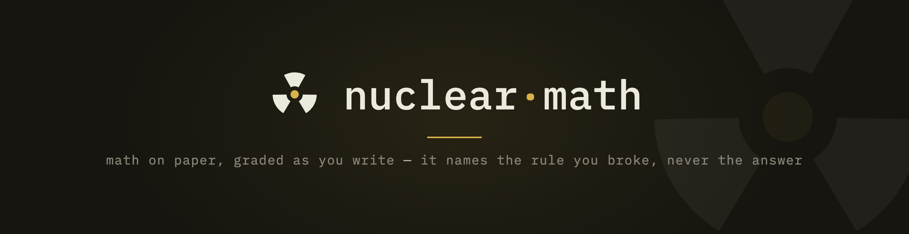
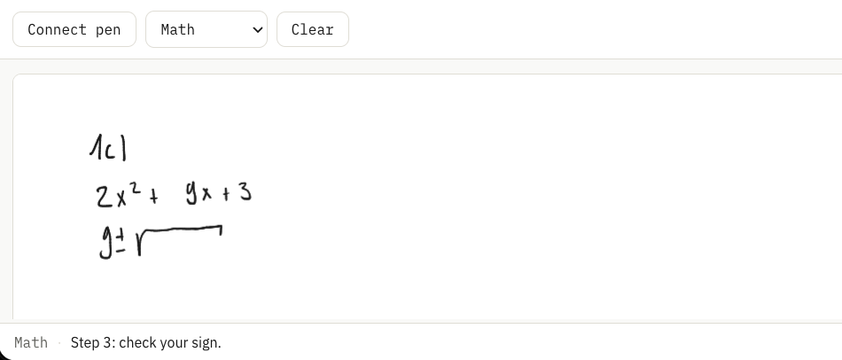
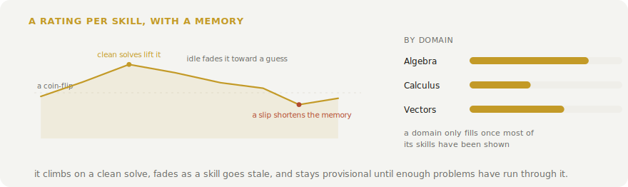

<p align="center">
  
</p>

# nuclear-learning

   

> You antisocial folks will particularly like this one

A math tutor for paper. You write with a Neo Smartpen, the strokes stream into the browser over Bluetooth, and a model grades every scan as the page grows. It stays quiet while your work is correct, and the moment you settle on a wrong step it says so out loud — locating the step by what you actually wrote, in one spoken sentence, in English or Swiss German. When everything on the page is finished and right, it tells you.

<p align="center">
  
</p>

## How it hints

A bare "this is wrong" is worth almost nothing — in the feedback meta-analyses it measures near zero, because you could just look the answer up. What does measure is an explanation that stops short of the answer, so the hints climb a ladder, one level per failed fix, the way a human tutor escalates. The first hint locates the step and makes the flaw felt: a slip gets a terse recheck cue, a misapplied rule gets the wrong move named or a pointed question. If you rework the spot and it is still wrong, the next hint names the principle the step violates. Still stuck, and it tells you the next concrete move along your own route — split into cases, isolate the variable — but never a resulting value. The last rung sends you to the printed solutions for that one step, with instructions to explain it to yourself and rewrite it in your own words. Writing a question mark next to a flagged spot advances the ladder a rung without waiting for a failed fix.

At no level does it reveal the corrected expression or the answer. That restraint is load-bearing: in a randomized trial with about a thousand math students, an answer-revealing chatbot made exam scores worse than no help at all, while the same model behind a no-reveal guardrail helped. You fix your own errors here, which is also why the fixes stick.

Mistakes you mark yourself are respected: a line struck through or labelled "falsch" with an arrow to a redo is finished business, never re-flagged. A double underline marks a result as final, and only then is it judged as one.

## How it works

The pen streams (x, y, pressure) points over Web Bluetooth onto a canvas. When you pause, the page is cropped to just the ink and sent to the OpenAI API as a vision message. There is no OCR step; the model reads the ink directly.

The moment the whole question is written, GPT-5.4 solves it once at medium effort and keeps that answer as a checklist. From then on GPT-5.4 mini verifies every scan against the checklist, staying quiet while a line is mid-working and speaking once you settle a wrong step. GPT-5.4 signs off a finished, correct answer before the app says so. So the strong model runs twice per problem, once to solve and once to confirm, and the cheap one carries the repetitive middle. Grading follows school convention rather than pedantry — a simplification task assumes its expressions are defined, so it will not demand absolute-value bars the textbook answer omits, but it will never wave through a lost solution of an equation. Everything is spoken as words rather than symbols, so a hint comes through as "x squared" or "the square root of two".

## What it remembers

Every mistake you fix becomes a review card, built from your own error and the worked solution already in hand, so you re-test the actual fix on a spacing schedule rather than a generic question bank. Corrected errors are the most memorable kind of correction, but they resurface after about a week — the expanding schedule is what makes the fix permanent.

Every solved problem also tags the skills behind it against a fixed map of 125 maths skills, from sign handling up through the chain rule and proof by induction. Each skill carries a rating that climbs on a clean solve, fades toward a guess as it goes stale, and stays provisional until enough problems have run through it. The Progress tab turns that into a recommendation — the weakest skill worth drilling and the strongest one going stale — and can generate a practice problem for it on demand, pitched so you would get it right about four times in five. Copy it onto the pad and the loop starts again. None of the tracking costs an extra request, and it can be turned off.

The same data anchors a rank. Every skill sits at a curriculum level from school foundations up to ETH entrance, a skill counts as secured at 70% mastery on real evidence, and six ranks — Apprentice to Grandmaster — gate on how much of each stage you hold: the rank in the corner literally answers where you stand between high school and university. Secured skills decay when left unpractised, so a rank is held, not owned.

<p align="center">
  <picture>
    <source media="(prefers-color-scheme: dark)" srcset="docs/skill-dark.svg">
    
  </picture>
</p>

## Presets

The grader is one system prompt plus a few settings, edited live in the Presets tab or in `config/modes.json`. New presets clone the shipped math grader, so a variant starts from the tuned baseline — the conventions, the hint ladder, the self-correction protocol — instead of a blank slate. `feedbackStyle` is `"spoken"`, `"chime"`, or `"both"`; `debounceMs` is the pause before a check. The engine settings, models, effort, and prices live in `config/settings.json` and the same panel.

## Run it

You need Node and a Chromium-based browser. Web Bluetooth is not in Safari or Firefox, and Brave has it off by default (enable it at `brave://flags/#brave-web-bluetooth-api`).

```bash
npm install
cp .env.example .env   # then add your OpenAI API key
npm run dev
```

Open the printed URL, connect the pen, and write. Pairing only works over `localhost` or `https`, and on macOS the browser needs Bluetooth permission. Once paired, the pen reconnects on its own. The key is read from `VITE_OPENAI_API_KEY` and used from the browser, so keep it local and use one you can rotate.

## Hardware

| Item | Price |
|---|---|
| Neo Smartpen (M1 / M1+ or compatible) | CHF 74 to 129 |
| D1 refills (3-pack) | CHF 5 |
| Ncode paper (print your own or buy a notebook) | CHF 0 to 16 |
| Any BLE earbud (optional, for spoken feedback in your ear) | CHF 15 to 20 |

## License

MIT
