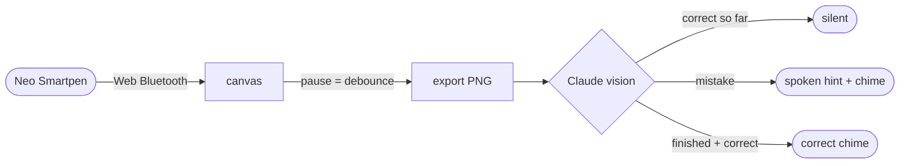

# nuclear-learning

Real-time feedback for handwritten work. You write on paper with a Neo Smartpen, the strokes stream into the browser over Bluetooth, and a moment after you pause the page is sent to Claude, which reads it and tells you — spoken aloud or with a chime — whether it found a mistake. The point is a tight write-check-correct loop: you fix the error yourself from a one-line hint instead of being shown the answer.

<p align="center">
  
  
  
  
  
</p>

## How it works

The pen streams (x, y, pressure) points over Web Bluetooth. The app draws them onto a canvas, fitting the pen's page coordinates to the drawing area as it goes. When you stop writing for a beat (a per-mode debounce), the canvas is exported to a PNG and sent to the Claude API as a vision message under the active mode's system prompt — there is no separate OCR step, Claude reads the ink directly.



It stays quiet while you are working correctly. Only an actual mistake (a one-line spoken hint) or a finished, correct result (a single chime) interrupts you. Before judging, the model verifies the step in a brief internal reasoning pass, so it errs toward silence rather than crying wolf.

## Modes

A mode is a system prompt plus a few settings. Four ship by default: math, chemistry notation, German, and freeform note-reading. Each decides how the work is judged and how the result reaches you.

To add a mode, edit `config/modes.json` and add an object — no code changes. Each entry has:

- `id` — short slug, used internally
- `label` — what shows in the dropdown
- `systemPrompt` — the full instruction sent to Claude
- `feedbackStyle` — `"spoken"`, `"chime"`, or `"both"`
- `debounceMs` — how long to wait after the last stroke before checking
- `errorChecking` — `true` for grading modes; set `false` for read-only modes that should never inject error-detector context

```json
{
  "id": "physics",
  "label": "Physics",
  "feedbackStyle": "both",
  "debounceMs": 1200,
  "errorChecking": true,
  "systemPrompt": "You are checking handwritten physics working. Reply OK while it is correct but unfinished, CORRECT when finished and right, otherwise name the first error in one short sentence."
}
```

Global settings — stroke colour, pressure, zoom cap, voice language and rate, chime files, model, and token budget — live in `config/settings.json`.

## Staying coherent across a page

A page is checked many times as you write, so the app keeps the scans consistent instead of treating each one as a fresh shot:

- The same correction is never replayed. A verdict is only spoken or chimed when it differs from the last one delivered, so while you are still fixing "Step 3: check your sign" it stays on screen but stops talking.
- Each request carries the verdicts already given on the page as context, so Claude stays consistent with itself — it does not re-flag a line it already confirmed, and it keeps reporting the same first unresolved error until you fix it, then moves on to the work that follows.
- Feedback follows you to the problem you are currently on. Several problems can share a page (1a, 1b, 2) and it grades the lowest unfinished one rather than staying pinned to an earlier problem's error.
- Requests are sent one at a time and in order, so verdicts never arrive out of sequence.

When you start a new problem you can press Clear. That wipes the pad and resets the page context, so feedback starts clean and a late reply from the previous problem cannot leak into it. Switching mode resets the context the same way but keeps your drawing.

## Running it

You need Node and a Chromium-based browser (Chrome or Edge) — Web Bluetooth is not available in Safari or Firefox, and Brave has it off by default (enable it at `brave://flags/#brave-web-bluetooth-api`).

```bash
npm install
cp .env.example .env   # then put your Anthropic API key in .env
npm run dev
```

Open the printed localhost URL, click Connect pen, pick a mode, and start writing. Pairing only works over `localhost` or `https`, and on macOS the browser needs Bluetooth permission (System Settings → Privacy & Security → Bluetooth).

The key is read from `VITE_ANTHROPIC_API_KEY` and used directly from the browser, so it is visible to anyone who can open the page. Keep this local and use a key you can rotate.

## Chimes

If `public/correct.mp3` and `public/error.mp3` exist they are played; otherwise the app synthesises a short tone (a rising pair for correct, a low buzz for an error). Drop your own files into `public/` to override them.

## Hardware

| Item | Price |
|---|---|
| Neo Smartpen (M1 / M1+ or compatible) | CHF 74–129 |
| D1 refills (3-pack) | CHF 5 |
| Ncode paper (print your own or buy a notebook) | CHF 0–16 |
| Any BLE earbud (optional, for spoken feedback in your ear) | CHF 15–20 |

## Tuning

Everything tunable lives in `config/settings.json`:

| Setting | What it does |
|---|---|
| `api.model` | `claude-sonnet-4-6` by default (low latency); switch to `claude-opus-4-8` for harder problems |
| `api.maxTokens` | room for the model's reasoning pass plus the one-line verdict |
| `canvas.maxScale` | zoom cap — higher renders your writing bigger, lower smaller |
| `canvas.pressureMultiplier` | stroke-width response to pen pressure |
| `audio.voiceLang` / `audio.rate` | spoken-feedback voice and speed |

## Notes

The pen SDK (`web_pen_sdk`) is a webpack bundle that pulls in Firebase, jQuery and JSZip, and references the Node `global`/`process` along with Neo's ncode page-definition files, even though this app uses none of that. `vite.config.ts` and a small inline shim already handle it, so a clean `npm install` is all that is needed; the audit warnings on install come from those old transitive dependencies, not from this code.

## License

MIT
