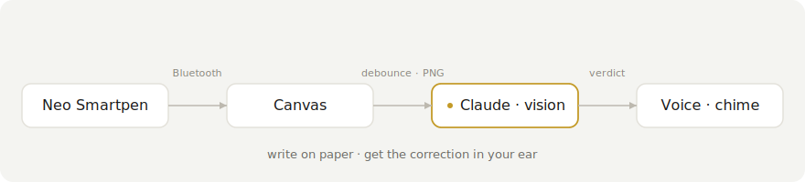

# nuclear-learning

Real-time feedback for handwritten work. You write on paper with a Neo Smartpen, the strokes stream into the browser over Bluetooth, and a moment after you pause the page is sent to Claude, which reads it and tells you — spoken aloud or with a chime — whether it found a mistake. The point is a tight write-check-correct loop: you fix the error yourself from a one-line hint instead of being shown the answer.

<p align="center">
  
</p>

<p align="center">
  
  
  
  
</p>

## How it works

The pen streams (x, y, pressure) points over Web Bluetooth. The app draws them onto a canvas, fitting the page coordinates to the drawing area as it goes. When you pause for a beat — a per-mode debounce — the canvas is exported to a PNG and sent to the Claude API as a vision message under the active mode's system prompt. There is no separate OCR step; Claude reads the ink directly.

It stays quiet while you are working correctly. Only an actual mistake (a one-line spoken hint) or a finished, correct result (a single chime) interrupts you. The model verifies the step in a brief internal reasoning pass before it judges, so it errs toward silence rather than crying wolf.

## Modes

A mode is a system prompt plus a few settings. Four ship by default: math, chemistry notation, German, and freeform note-reading. Each decides how the work is judged and how the result reaches you.

To add one, edit `config/modes.json` and append an object — no code changes:

```json
{
  "id": "physics",
  "label": "Physics",
  "feedbackStyle": "both",
  "debounceMs": 1200,
  "errorChecking": true,
  "systemPrompt": "You are checking handwritten physics working. Reply OK while it is correct but unfinished, CORRECT when finished and right, otherwise name the first error in one short sentence."
}
```

- `feedbackStyle` — `"spoken"`, `"chime"`, or `"both"`
- `debounceMs` — how long to wait after the last stroke before checking
- `errorChecking` — `true` for grading modes; `false` for read-only modes that should never be given error-detector context

## Staying coherent across a page

A page is checked many times as you write, so the scans stay consistent instead of each being a fresh shot:

- The same correction is never replayed. A verdict is spoken or chimed only when it differs from the last one, so while you are still fixing "Step 3: check your sign" it stays on screen but stops talking.
- Each request carries the verdicts already given as context, so Claude stays consistent with itself — it does not re-flag a line it already confirmed, and it keeps reporting the same first unresolved error until you fix it.
- Feedback follows you to the problem you are on. Several problems can share a page (1a, 1b, 2) and it grades the lowest unfinished one rather than staying pinned to an earlier error.
- Requests run one at a time and in order, so verdicts never arrive out of sequence.

Pressing Clear wipes the pad and resets the page context for a clean start on the next problem. Switching mode resets the context the same way but keeps your drawing.

## Running it

You need Node and a Chromium-based browser (Chrome or Edge) — Web Bluetooth is not in Safari or Firefox, and Brave has it off by default (enable it at `brave://flags/#brave-web-bluetooth-api`).

```bash
npm install
cp .env.example .env   # then put your Anthropic API key in .env
npm run dev
```

Open the printed localhost URL, click Connect pen, pick a mode, and start writing. Pairing only works over `localhost` or `https`, and on macOS the browser needs Bluetooth permission (System Settings → Privacy & Security → Bluetooth).

The key is read from `VITE_ANTHROPIC_API_KEY` and used directly from the browser, so it is visible to anyone who can open the page. Keep this local and use a key you can rotate.

## Settings

Everything tunable lives in `config/settings.json`:

| Setting | What it does |
|---|---|
| `api.model` | `claude-opus-4-8` by default (most accurate); switch to `claude-sonnet-4-6` for faster, lighter checks |
| `api.maxTokens` | room for the model's reasoning pass plus the one-line verdict |
| `canvas.maxScale` | zoom cap — higher renders your writing bigger, lower smaller |
| `canvas.pressureMultiplier` | stroke-width response to pen pressure |
| `audio.voiceLang` · `audio.rate` | spoken-feedback voice and speed |
| `audio.chimeCorrect` · `audio.chimeError` | drop `.mp3` files in `public/` to use real chimes; otherwise a tone is synthesised |

## Hardware

| Item | Price |
|---|---|
| Neo Smartpen (M1 / M1+ or compatible) | CHF 74–129 |
| D1 refills (3-pack) | CHF 5 |
| Ncode paper (print your own or buy a notebook) | CHF 0–16 |
| Any BLE earbud (optional, for spoken feedback in your ear) | CHF 15–20 |

## License

MIT
