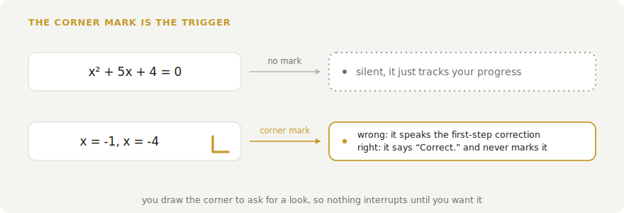
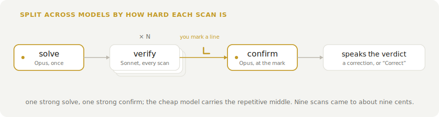
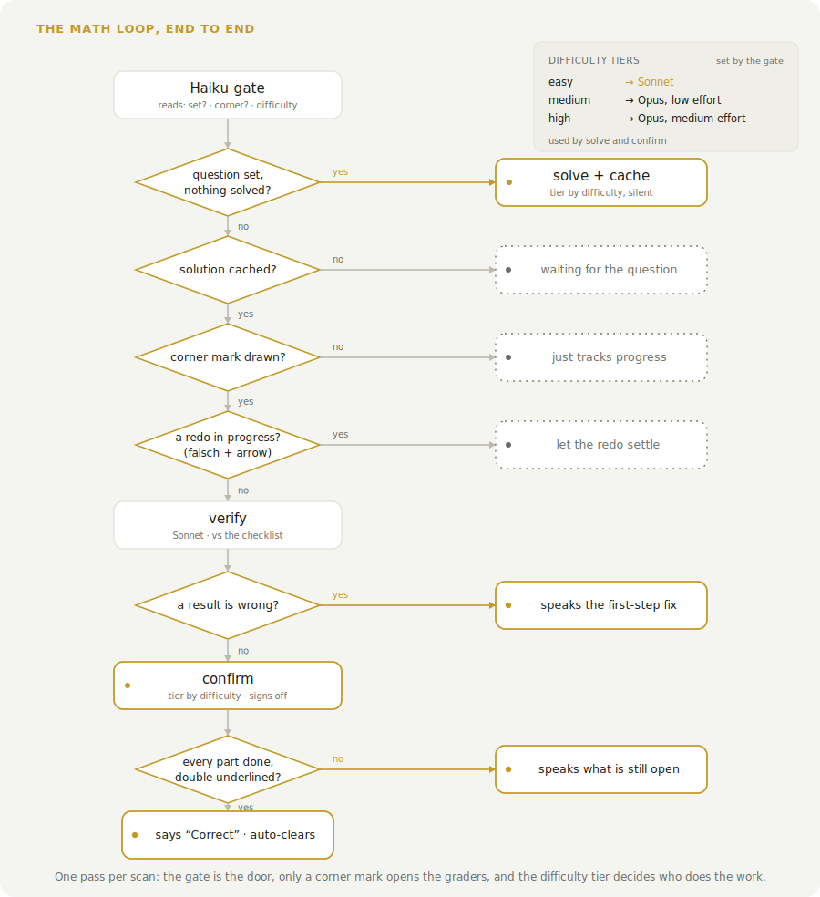

<p align="center">
  
</p>

# nuclear-learning

   

> You antisocial folks will particularly like this one

Real-time feedback on handwritten work. You write on paper with a Neo Smartpen, the strokes stream into the browser over Bluetooth, and when you want a check you draw a small corner mark next to a line. A moment later that page goes to Claude, which reads the flagged work and answers out loud: a one-line correction if something is off, or a quiet word that it is right. It names the first error and never gives the answer, so you fix it yourself and carry on. Leave the mark off and it stays quiet, however much you write. It is most tuned for mathematics right now; the other subjects work but are lighter.

<p align="center">
  
</p>

## Drawing a corner to ask

The corner mark is the whole interface for feedback. Draw a small right-angle hook beside a line and the app looks at it: if a result is wrong it speaks the first step to check, and if the work is finished and right it says so, without stamping it done. It reads the mathematics aloud as words rather than symbols, so a hint comes through as "x squared" or "the square root of two", in English or Swiss German. When you catch your own slip, mark it "falsch" and draw an arrow to a redo, it leaves you alone until the redo settles. A problem is only acknowledged correct once every part carries its own double-underlined answer.

<p align="center">
  <picture>
    <source media="(prefers-color-scheme: dark)" srcset="docs/corner-dark.svg">
    
  </picture>
</p>

## How it works

The pen streams (x, y, pressure) points over Web Bluetooth onto a canvas. When you pause, the page is cropped to just the ink and sent to the Claude API as a vision message. There is no OCR step; Claude reads the ink directly.

Cost stays low because the app only spends when there is something to do. On every scan a cheap model does two small jobs, checking whether the whole question is written yet and whether you have drawn a corner mark. The moment the question is complete it solves it once on a strong model and keeps that answer as a checklist, ready and waiting. Then nothing more runs until you mark a line, and only then does a cheaper model verify your work against the checklist and the strong model sign off before it speaks. So writing the question and working through it barely cost, and the heavy checking only happens on the lines you flag.

<p align="center">
  <picture>
    <source media="(prefers-color-scheme: dark)" srcset="docs/routing-dark.svg">
    
  </picture>
</p>

## The full loop

Every scan runs one pass through the same gate, and this is the whole of it, from a blank page to a solved problem. The cheap watcher decides whether anything expensive runs, the corner mark decides whether you hear about it, and the difficulty tier decides which model does the work. So an easy problem is graded from start to finish without ever touching Opus.

<p align="center">
  <picture>
    <source media="(prefers-color-scheme: dark)" srcset="docs/flow-dark.svg">
    
  </picture>
</p>

## What it remembers

Every mistake you fix is kept as a review card, built from your own error and the worked solution already in hand, so you re-test the actual fix on a spacing schedule rather than a generic question bank. And every solved problem tags the skills behind it against a fixed map of maths, from sign handling up through the chain rule and proof by induction. Underneath, each skill carries a rating that climbs on a clean solve, fades toward a guess as it goes stale, and stays provisional until enough problems have run through it. None of it costs an extra request, and it can be turned off.

<p align="center">
  <picture>
    <source media="(prefers-color-scheme: dark)" srcset="docs/skill-dark.svg">
    
  </picture>
</p>

## Modes

A mode is a system prompt plus a few settings, edited live in the Presets tab or in `config/modes.json`. Maths ships with the full loop above: the corner-mark trigger, the tiered models, and the skill map. Chemistry, German, and freeform note-reading ship as lighter graders. To add one, append an object, no code changes either way:

```json
{
  "id": "physics",
  "label": "Physics",
  "feedbackStyle": "both",
  "debounceMs": 1200,
  "cornerGated": true,
  "systemPrompt": "You are checking handwritten physics working. Reply OK while it is correct but unfinished, CORRECT when finished and right, otherwise name the first error in one short sentence."
}
```

`feedbackStyle` is `"spoken"`, `"chime"`, or `"both"`; `debounceMs` is the pause before a check; `cornerGated` holds a mode's comments until you draw a corner, the way maths does. The engine settings, models, effort, and prices live in `config/settings.json` and the same panel.

## Run it

You need Node and a Chromium-based browser. Web Bluetooth is not in Safari or Firefox, and Brave has it off by default (enable it at `brave://flags/#brave-web-bluetooth-api`).

```bash
npm install
cp .env.example .env   # then add your Anthropic API key
npm run dev
```

Open the printed URL, connect the pen, pick a mode, and write. Pairing only works over `localhost` or `https`, and on macOS the browser needs Bluetooth permission. Once paired, the pen reconnects on its own. The key is read from `VITE_ANTHROPIC_API_KEY` and used from the browser, so keep it local and use one you can rotate.

## Hardware

| Item | Price |
|---|---|
| Neo Smartpen (M1 / M1+ or compatible) | CHF 74 to 129 |
| D1 refills (3-pack) | CHF 5 |
| Ncode paper (print your own or buy a notebook) | CHF 0 to 16 |
| Any BLE earbud (optional, for spoken feedback in your ear) | CHF 15 to 20 |

## License

MIT
